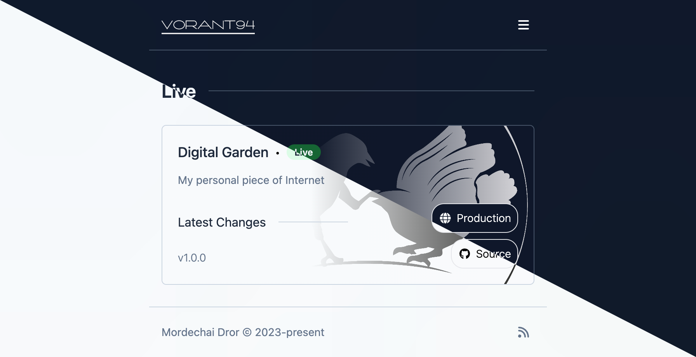

## 🎉New Section: Projects🎉



The main part of this update is a new "Projects" section.

When I started this blog the main source for post ideas was my day-to-day job, but since then I came up with a couple of ideas for my own so-called pet-projects. At the moment I have 3 of those including the blog itself. I discover a lot of cool stuff while coding them, but most times it's not enough to write a whole post about it. But from the other side I also don't want to leave the blog without content for too long.

So I came up to a conclusion to combine pet-project coding and blogging: I'll showcase the projects I work on and share my findings in the form of changelogs. Those changelogs aren't meant to be just formal list of changes since the last publication, but rather a stories of what, how and why I did in the scope of the project. So they should be as interesting to read as a regular post.

The current Posts section I'll use for less technical topics, I assume. Something like the [Divide and conquer](https://www.vorant94.io/posts/divide-and-conquer-right-concerns-to-separate) post I wrote recently, which is less of "how-to" guide with concrete 1-2-3 steps, but more like abstract thoughts on some question trying to start a discussion. Also this section is meant to be used for writings that totally not related to programming.

Also I'm not sure how properly integrate changelogs into RSS feed and how exactly to show the most recent ones on the home page without introducing too much noice there. So there are definitely places for improvements.

## Mobile navigation


Since the number of navigation items in the header grows, I needed to come up with at least some sort of adaptive navigation for mobile. I stopped at classic burger-button and full-screen overlay with some small animations. And now I get it why back-end devs consider front-end ones not a real programmers...

#### CSS Animations

Up until now I didn't have a lot of experience with animations. At the job it either wasn't prioritized or we simply used 3-rd party libraries with built-in animations. It changed when I started playing with Flutter and now when I needed to animate mobile navigation for the blog.

Animations in Flutter works this way:

- you have `AnimationController` class, that you can run forward, pause, resume, run backward or cycle it
- each `AnimationController` produces its state in the form of decimal values in the range from 0 to 1
- you can also define the curve of how value of `AnimationController` changes over time as well as the total animation duration

It looks something like this:

```dart
// somewhere in the widget tree
late final AnimationController _controller = AnimationController(
	duration: const Duration(seconds: 10),
	vsync: this,
)..repeat();

// widget, that is capable of being animated
class SpinningContainer extends AnimatedWidget {
	const SpinningContainer({
		super.key,
		required AnimationController controller,
	}) : super(listenable: controller);

	Animation<double> get _progress => listenable as Animation<double>;

	@override
	Widget build(BuildContext context) {
		return Transform.rotate(
			angle: _progress.value * 2.0 * math.pi,
			child: Container(width: 200.0, height: 200.0, color: Colors.green),
		);
	}
}
```

In Web you can achieve exactly the same with JavaScript and inline styles, but more efficient and go-to way to do it is CSS animations. With CSS animations it is possible to declare animations on a specific selector. The browser will render the animation as soon as matched selector will be found.

```css
/* declaring custom animation */
@keyframes example {
  0%    {
    background-color: red;
  }
  25%   {
    background-color: yellow;
  }
  50%   {
    background-color: blue;
  }
  100%  {
    background-color: green;
  }
}

/* applying animation to a specific selector */
.example  {
  width: 100px;
  height: 100px;
  background-color: red;
  animation-name: example;
  animation-duration: 4s;
}
```

Now, now can we programmatically control animation flow? In short we can't. As a result of CSS being a man-in-the-middle we "animating" elements by **adding or removing classes** from them. We can't control one element animation from the other, we can't change it half-way and so on and so forth. We can't program it, which actually gives me a feeling of playing with no-code🤷‍♂️

## Swap comments platform


My blog is SSG one, which means there is no backend behind it. Which means that from one side I don't have to pay money for a such, but from another - I needed to find a way to achieve some data persistence. The posts are `.md` files that are stored alongside the source code of the repo. But what about the comments?

Up until recently I used [utterances](https://utteranc.es/), a light-weight app, that can use GitHub issues as a comments platform. And while it did its job well, I found its twin-brother, [giscus](https://giscus.app/), and instantly migrated without hesitation.

Both services follow the same workflow:

- There is a component that needs to be properly configured and added to the page
- This component sends API requests to its respective server, which is hosted by app authors
- The server uses its GitHub app to add comments in configured GitHub repo (repo owner needs to authorize the app separately)

The main difference is that while utterances is based upon GitHub issues, giscus is based upon GitHub discussions. This gives a good separation between permanent threads (e.g. comments that are stored as discussions) and the ones that are meant to be closed (e.g. bugs/features/refactors that are stored as issues) without need for a separate repo. The UI of discussions is a little bit different, but it supports comment threads which is not the case with issues.

Also giscus supports reactions based upon the same GitHub discussions, which is really nice to have. And as a bonus point giscus has official adapters for most popular front-end frameworks and a couple more little features.
