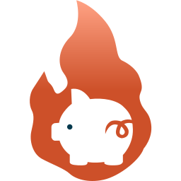

## Firefly III

## Nextcloud

## ArchiveBox

## Jellyfin

## Heimdall

## Tech setup

I have a [Raspberry Pi 4 Model B](https://www.raspberrypi.com/products/raspberry-pi-4-model-b/) with 8 Gb of RAM. It is wired connected to [Asus RT-AX55](https://www.asus.com/networking-iot-servers/wifi-routers/all-series/rt-ax55/) Wi-Fi router, which among other things allows to configure your own custom DNS-server

> Domain Name System (DNS) in short words is service that provides configuration between computer real physical addresses in the network (like 8.8.8.8) and human-readable names that we all using (like google.com)

As of now I have there [Manjaro Linux OS](https://manjaro.org/)

docker compose with nginx reverse proxy
