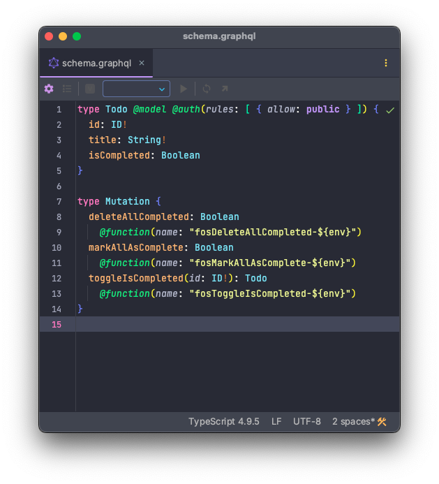
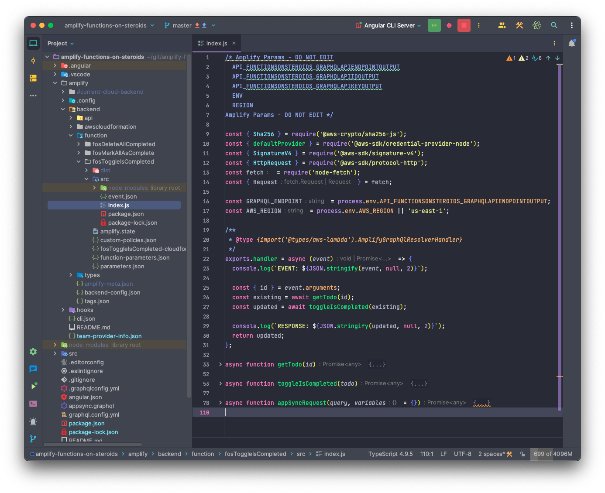
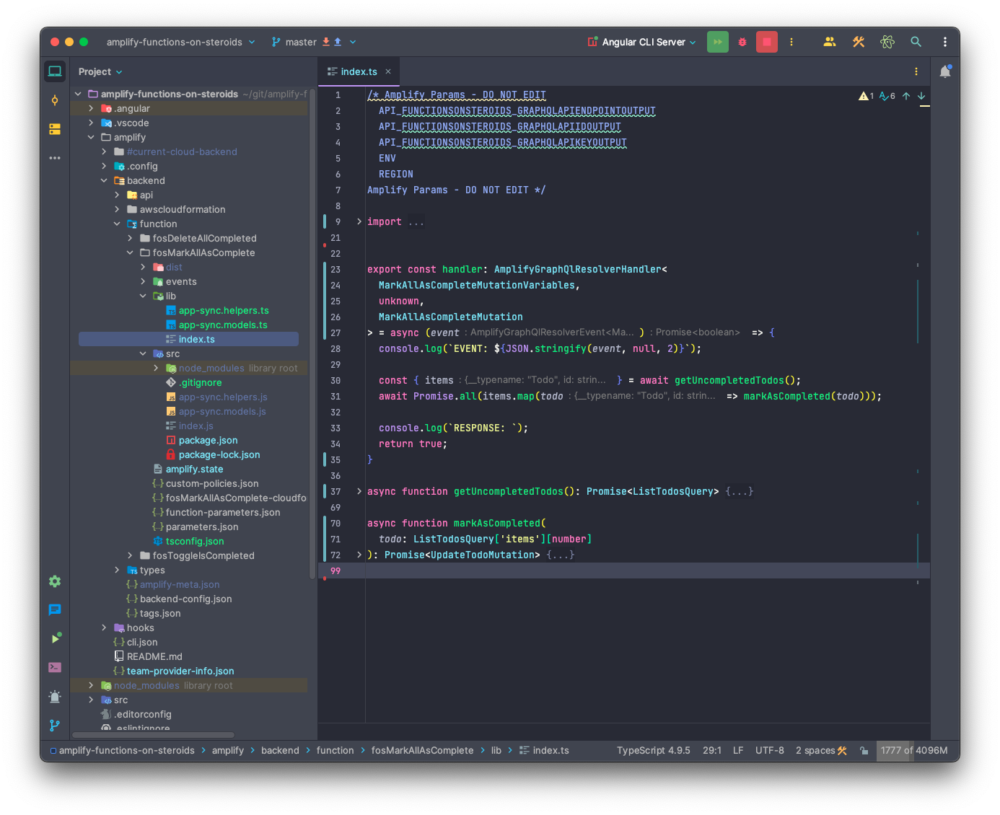
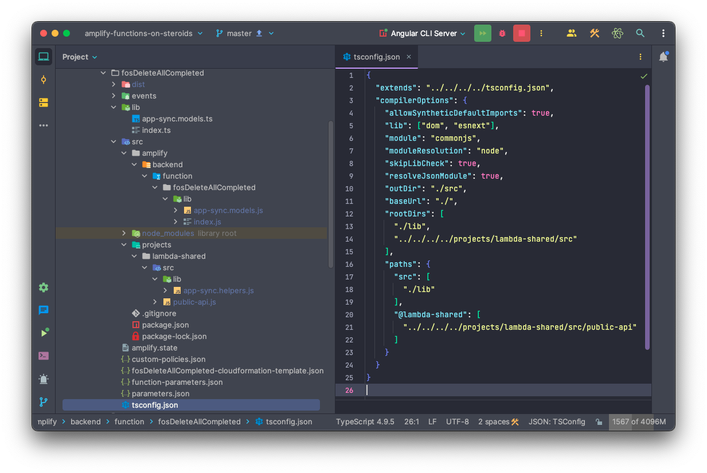
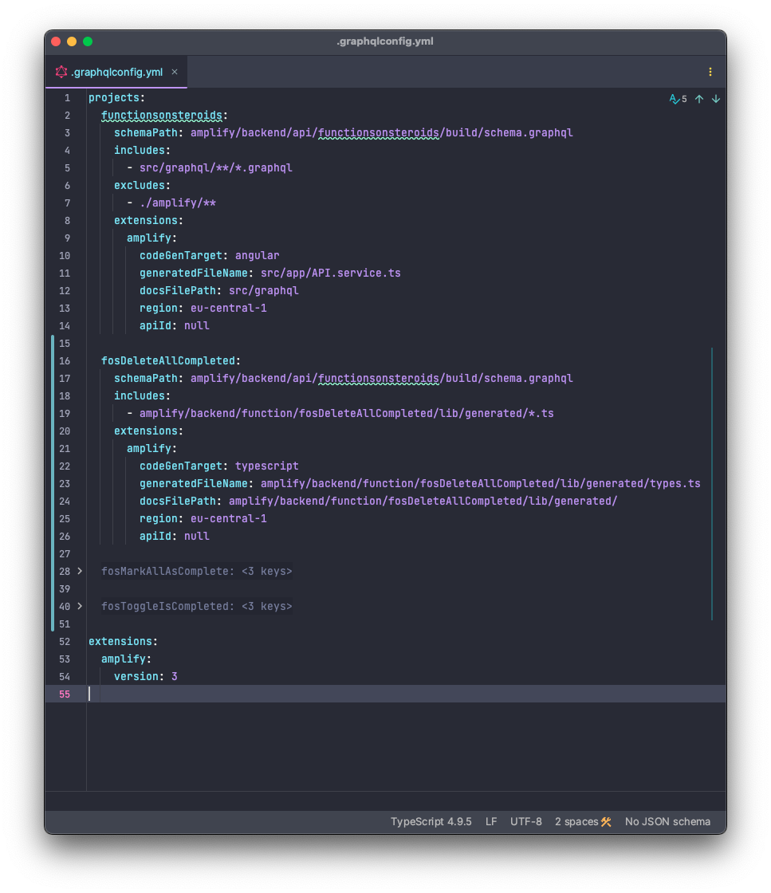

### What we have out of the box

When we add an API to Amplify project it out-of-the-box offers us key-value storage to store all of our data (using DynamoDB) and GraphQL-based CRUD API to access it (using AppSync) with a bunch of directives to customize the schema. The customization means we as a developers are not limited to CRUD only. For example, there are a couple of ways to implement a custom resolvers based on our business logic requirements. One of these ways is to define a Lambda function and link it in schema via `@function` directive. Those lambdas can be written in different languages, but we will focus more on Node.JS since it is nice to have the same language ecosystem both on Front-End and Back-End side. In our case there will be three custom mutation resolvers: one to mark all current todos as completed, second to delete all of the completed todos and third to toggle completion of a todo (instead of setting it to either `true` or `false` manually). The UI should look something like this:

After we add Amplify to the project, lets define our data model and add a functions to our project (see the official documentation [here](https://docs.amplify.aws/cli/function/) and [here](https://docs.amplify.aws/cli/graphql/custom-business-logic/#lambda-function-resolver) for the exact steps). In the end our schema should look somewhat like this:

A couple of side bonuses:

> First thing no note is that Amplify CLI offers to name the function with project name used as a prefix (e.g. `functionsonsteroids1fa063ec`). You would like to follow this pattern (maybe use some shortened version of your project name like in my case it is `fos`) since without in lambdas from different projects with the same name can cause conflicts. When it comes to different environments of the same project Amplify under-the-hood adds suffix of the environment to avoid conflicts, but for some reason it doesn't automatically add project name as prefix, so we need to to it manually.

> In case you are using WebStorm / IntelliJ in order for IDE not to scream at you about "unknown directives" and so on, you'd like to create `appsync.graphql` with content from this [Gist](https://gist.github.com/cietho/87463cfa77ffa9917d1b1425e01049bd)  and mention it as a schema alongside with your actual project schema in `graphql.config.yml` at the root of the repo.

So as of now we have three separate JavaScript lambda functions with all the necessary logic already implemented. Here are file structure and code of one of our three lambdas just for a reference:

Our goals are:
- Migrate them to TypeScript
- Share common code between them
- Get types for them from Amplify CLI Codegen
- Have as less trade-offs as possible

### TypeScript support

Amplify documentation offers us a [handy guide](https://docs.amplify.aws/cli/function/build-options/) on how to do it, which is a good starting point (don't ask me why they hid it under the "Build options" and didn't do a dedicated post).

Now, there are three particular points of lambda lifecycle that we are interested in. First of all it is local runtime, when we are running lambda via `amplify mock` or we pushing the changes with CLI via `amplify push`. Second is actual runtime after building the code and pushing it to the cloud. And third is CI/CD, where the cloud is watching for git repo changes and deploying our project by itself. Each of those points has its own pitfalls, that we need to play around.

First if we just leave all of the lambda dependencies in its own `package.json`, neither `amplify build` nor `amplify mock` will actually work. It happens so since in those cases amplify CLI uses repo's root `package.json` and not lambda's local `package.json` e.g. all of the actual lambda dependencies (excluding dev dependencies) that are mentioned in the local lambda `package.json` must be duplicated as dev dependencies (at least) inside root `package.json`.

> It can work without it only when it happens so root `package.json` dependencies by themself include all lambda `package.json` ones (and it is the case if we used `AppSync - GraphQL API request (with IAM)` template for creating the lambda), but when we try to add more types e.g. `AmplifyGraphQlResolverEvent` from `aws-lambda` the IDEA and build script will start to scream at us since at this point of time root `package.json` is the boss.

> If running `amplify mock` results in Unauthorized Error despite proper permissions of lambda and despite the fact that everything works fine in runtime itself, check this [section in docs](https://docs.amplify.aws/cli/graphql/authorization-rules/#use-iam-authorization-within-the-appsync-console), which explains that we need to add `custom-roles.json` file in order to have permissions we need.

If we would want to keep dependencies clear from duplicates otherwise by removing dependencies from lambda personal `package.json` and leaving them only in root `package.json`, we also cannot do it. It will successfully pass build and push, but will fail in the actual runtime. So those duplicates are with us (hopefully just for now).

The last point of time that I mentioned earlier is Amplify CI/CD. Since as of now all we did was via Amplify CLI locally on our machine we didn't face another small issue yet. By default Amplify CI/CD installs dependencies only during frontend step, so the build of backend will actually fail because of lack of `tsc` in the machine. The easiest way to deal with it is by downloading Amplify CI/CD config from AWS console, adding there `preBuild` phase (you can just copy it from the frontend step) in backend step and storing the updated config in the root of the repo so it will override the default one in the cloud.

After all the preparation is done, we can now re-write the actual JS code of the lambda to be TS. Additionally I added `.gitignore` in `src` of lambda, because we don't need to store transpilation result in the source code. Let's just manually copy-paste required AppSync types from generated UI code for now. We will make it way a lot more DRY in the next step. In the meanwhile here are updated file structure and source code of another one of our lambdas for reference (I put all the copy-pasted AppSync types into `app-sync.models.ts` and moved `appSyncRequest` function to `app-sync.helpers.ts`).

### Sharing code between lambdas

There is obvious code duplication between our lambdas. Let's start with the `appSyncRequest` function that signs and sends AppSync request. As far as I looked for a solutions our options are lambda layers and dedicated npm package. Each of them has serious trade-offs. At the moment there is no support for `amplify mock` for those lambdas that use lambda layers from one hand, and from another - publishing a separate npm package that is only used in the scope of one and only project is too much boilerplate and simply redundant.

Both those options are about sharing JavaScript code, but since we migrated to TypeScript we now actually have a bonus third option. We can configure the TypeScript compiler so it will combine code at build time from two places: one - our lambda-specific `lib` folder, second - shared utility folder. Since the project is based around Angular e.g. the repo is a fully featured multi-project workspace so we can generate a new library via `ng generate library lambda-shared` and store shared lambda code there nice and clear. Then in order to access it from lambdas we need to replace `rootDir` in each of lambdas `tsconfig.json` with `rootDirs` and thats it - `amplify mock` is in place, no unnecessary boilerplate, everybody is happy, yeah? Almost. There are a couple of gotchas that needs to be kept in mind...

- Since there are two `rootDirs` for TS compiler, the actual structure of the resulting JS inside `src` is changed (see the screenshot) and AWS Lambda runner points to actual entry file no more. We can narrow down this issue to purely cosmetic one by manually editing CloudFormation templates of lambdas (and its `package.json#main` property as well) so it will take into account a new file structure e.g.

- Amplify CLI cannot detect lambda changes if only a shared code is changed. It doesn't matter for CI/CD since we are ignoring all `.js` files, which means it will build it each time, but locally we might need to build lambda manually from time to time so `amplify push` can catch the stuff up.

-  Since `tsc` is building the whole shared folder each lambda have to include all its dependencies even though it might not use the functionality that requires those dependencies. E.g. if one of lambdas need to use `lodash` and its code is places into shared folder the lib have to be installed into all lambdas who benefit from shared code. It may lead to exceeding the lambda max size limit, but in that case we can swap TypeScript compiler with a Webpack, so lambda become bundled and the dependencies become tree-shakable.

- Shared lambda code is not telling by itself the permissions or environment variables that lambda must have in order to successfully execute it, so we need to remember to update it accordingly.

> As a bonus in order to avoid long `../../../../` imports from shared folder, you can add a couple of path aliases into `tsconfig.json`. But if you do so, don't forget to convert shortened imports back to long ones after transpilation. It can be done by adding `tsc-alias` run (after `tsc` run) into `amplify:...` scripts, that we added as a part of Amplify "Build options" guide.

### Amplify CLI Codegen multi-target

Now that we have a good support for TS it and we placed removed repetitive code, it would be nice just like in UI to benefit from auto-generated types based on our AppSync schema. According to this GitHub [issue](https://github.com/aws-amplify/amplify-codegen/issues/49) there is no support for multiple targets in Amplify Codegen at the moment, but... Since Amplify stores Codegen config as a file in the root of our repo we can update it manually to our needs and Codegen will do what we want him to do without any problem... Just don't tell this secret to anyone😜

> For some reason it only works if you agreed to generate all possible operations and types during adding or re-adding Codegen. Otherwise Codegen throws an exception that multiple projects are not supported.

The only problem with this approach is that the Codegen runs after the code is built and pushed to the cloud. E.g. if you change the schema you first need to do `amplify push`, then after you get updated types you need to make `amplify push` once again to re-build lambdas, that depends on those types. A possible workaround for it may be a separate push of API and lambdas (e.g. `amplify push api` at first and `amplify push function` after it). Or we can mock API (`amplify mock api`), which will trigger the build of API, which will trigger Codegen with latest changes, and then we can push everything together.

### Conclusion 

To sum up we achieved everything we wanted and are now ready to boost the productivity of any Amplify-based project, the trade-offs that we have as a result are:

- need to duplicate all of the lambdas dependencies as a dev dependencies in root `package.json`
- need to manually run lambdas build scripts if changes are made only in shared code
- need to add all the dependencies of shared code to each of lambda `package.json` even if a particular lambda doesn't use all of shared functionality
- need to manually document what permissions / env variables lambda must have in order to use shared code
- need to push changes twice in case lambda changes are dependent on schema API changes

All the code mentioned here you can find in my [GitHub](https://github.com/vorant94/amplify-functions-on-steroids)
